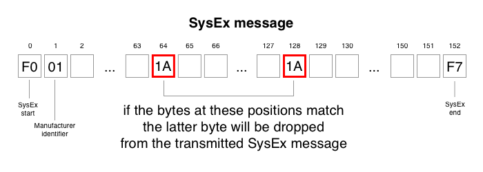
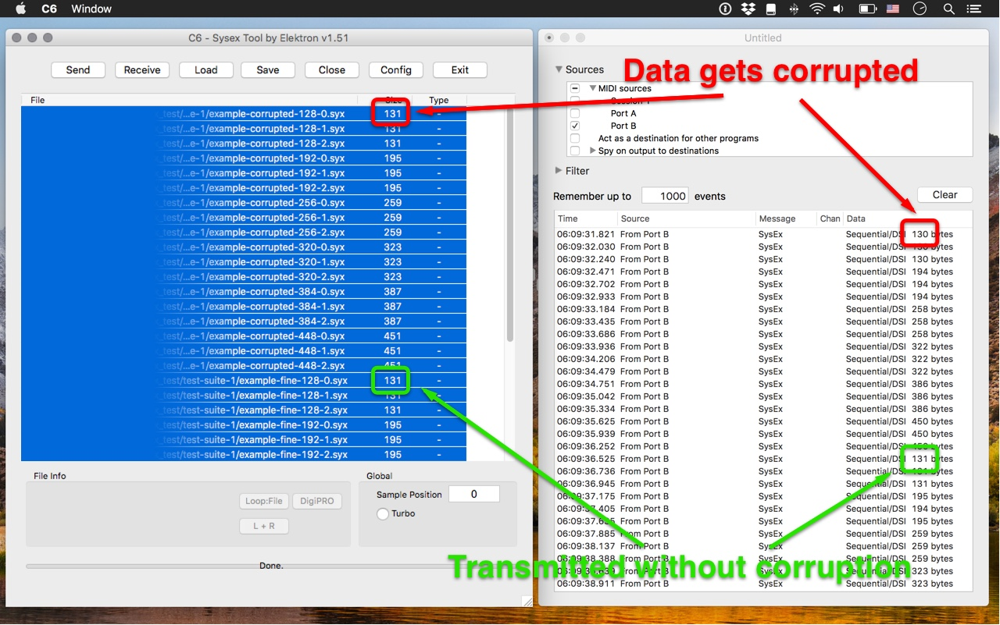

# Goal

**The goal of this project is to demonstrate the MIDI SysEx message corruption bug occurring in the MOTU MIDI Express XT USB (ROM version 3.1.0) unit in a reproducible manner.**

The XT is a high quality MIDI hardware with extensive routing and preset capabilities handy-capped only by SysEx forwarding issues that render SysEx dumps unusable and software SysEx editors limited.

We would like to help MOTU engineers as much as possible to reliably reproduce the bug, identify the causes and assist in fixing the firmware.

Let's make it happen!

# Our findings

- **Data corruption occurs when two consecutive bytes in the positions of 64, 128, 192, 256, 320 etc. have the same value in the SysEx message (see figure 1)**

- to demonstrate this we generated valid SysEx messages that get corrupted in the `test-suite-1` folder
- by setting up the XT to forward incoming SysEx messages from IN 8 to OUT 8, then using a separate USB-to-MIDI interface to send and receive messages from these ports we were able to verify our assumptions (see figure 2)

# Further conclusions

- Messages shorter than 130 bytes are not affected
  - The first matching can occur between the bytes in the positions of 64 and 128
  - Sysex messages always end with the `0xF7` byte and since SysEx data can only contain values between `0x00` and `0x7F`, thus the shortest possible corrupted message length is not 129 but 130
- Matching bytes are highly dependent on content: if your SysEx dump has large blocks of 0 values then you are almost always affected, while for other SysEx dumps where bytes in the specific positions are always different will never experience any problems
- Our findings are based on generating thousands of SysEx messages, feeding them through the XT, then comparing results with original files

# How can you help us

Run our test suite on your XT unit so we can confirm that these results can not only be demonstrated on our specific unit but all XT units.
please download the files from the `test-suite-1` folder, test them with your device and report your findings back to us.

To do this experiment please follow our instructions:

- Disconnect all MIDI cables from the device
- Set up you unit to forward MIDI messages from IN 8 to OUT 8 using Clockworks
- Connect your computer to the XT using the front panel MIDI ports (in 8 and out 8). For this connection you can use any MIDI-to-USB cable or device such as the M-Audio Uno, M-Audio Midisport 2x2 or something similar
- Use a SysEx librarian to transmit MIDI SysEx messages. We recommend Elektron C6 on Mac and Windows.
- To receive the SysEx messages coming from MIDI out 8 you can use C6 or any SysEx librarian for your operating system. On MacOS you can use Snoize MIDI monitor
- Save the received SysEx messages in a separate folder and send the results back to us

# Resources
[MOTU MIDI Express XT USB](http://motu.com/products/midi/xpressxt_usb)  
[Elektron C6](https://www.elektron.se/wp-content/uploads/2016/05/Elektron_C6_MAC_AND_WIN_1.51.zip)  
[Snoize MIDI Monitor](https://www.snoize.com/MIDIMonitor/)  
[Snoize SysEx Librarian](https://www.snoize.com/SysExLibrarian/)  

# Previous Discussions
https://www.gearslutz.com/board/electronic-music-instruments-and-electronic-music-production/1016182-motu-midi-express-xt-usb-ok-sysex.html  
https://www.gearslutz.com/board/music-computers/723334-motu-midi-express-xt-problem.html  
http://www.motunation.com/forum/viewtopic.php?f=2&t=49907  
